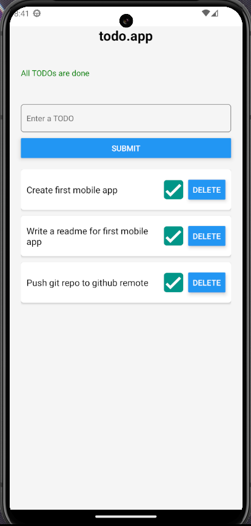

## A simple todo mobileapp
#### Built with React-Native and Expo 

My first mobile app development experience 😊

Follow the expo documentation to set up the development environment: [https://docs.expo.dev/get-started/set-up-your-environment/](https://docs.expo.dev/get-started/set-up-your-environment/)

To run intall node packages ```npm i```:

- For Android: ```npm run android```
- For IOS: ```npm run ios```

And maybe check react-native site: [https://reactnative.dev/](https://reactnative.dev/)


